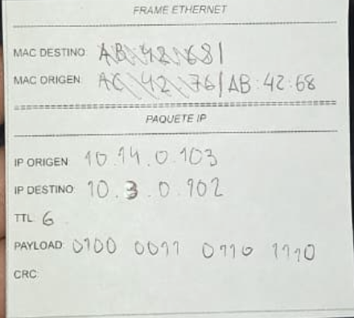

# Redes de Computadoras 2026

## Trabajo práctico N°1

**Integrantes**  
- Callovi, Lautaro
- Galoppo, José María
- Moreyra, Julián
- Rivera, Luis Mariano

**Grupo**: pingCollins

**Centro educativo**: FCEFYN - UNC

**Asignatura**: Redes de Computadoras

**Profesores**
- Henn, Santiago M.
- Oliva Cuneo, Facundo N.

**Fecha de entrega**: 26 de marzo de 2026

---
### Información de los autores
- jose.maria.galoppo@mi.unc.edu.ar (Galoppo, José María)
- luismarianorivera.25@mi.unc.edu.ar (Rivera, Luis Mariano)
- julian.moreyra@mi.unc.edu.ar (Moreyra, Julián)
- lautaro.callovi@mi.unc.edu.ar (Callovi, Lautaro Nicolás)
---

## Parte 1 - Simulación de envío de paquetes, ARP y ruteo entre redes.

## Resumen

En este trabajo práctico se desarrolló de manera "física y manual" el transporte de paquetes en una red WAN con el propósito de comprender conceptualmente su funcionamiento.

## Introducción

En la primera parte del laboratorio, nos dividimos en grupos que cumplieron la función de nodos, siendo tres grupos los nodos intermedios que funcionaron como routers. Cada grupo contaba con dirección IP, dirección MAC, máscara de subred y puerta de enlace predeterminada.

En la segunda parte, se realizaron técnicas de detección de errores mediante EDAC (Error Detection And Correction).

## Actividad 1

En este caso, nuestro grupo (PingCollins) cumplió la función de router.

### Configuración NIC - Router Ping Collins

**Datos del dispositivo:**
- Nombre: Router Ping Collins
- Dirección IP: 10.3.0.1
- Dirección MAC: AC:45:92
- Máscara de subred: 255.255.255.0 (/24)
- Gateway por defecto: N/A

## Actividad 2

**Interfaces:**
- eth0: 10.3.0.1 (subred 10.3.0.0/24, hacia nodos)
- eth1: 10.11.0.1 (subred 10.11.0.0/24, hacia router AC:45:10)
- eth2: 10.16.0.1 (subred 10.16.0.0/24, hacia router AC:45:10)
- eth3: 10.5.0.1 (subred 10.5.0.0/24, hacia router AC:45:10)

**Tabla de ruteo:**

| Destino      | Máscara          | Gateway    | Interfaz |
|--------------|------------------|------------|----------|
| 10.3.0.0     | 255.255.255.0    | Directa    | eth0     |
| 10.11.0.0    | 255.255.255.0    | Directa    | eth1     |
| 10.16.0.0    | 255.255.255.0    | Directa    | eth2     |
| 10.5.0.0     | 255.255.255.0    | Directa    | eth3     |
| 10.10.0.0    | 255.255.255.0    | 10.5.0.X   | eth3     |
| 10.6.0.0     | 255.255.255.0    | 10.5.0.X   | eth3     |
| 10.12.0.0    | 255.255.255.0    | 10.5.0.X   | eth3     |
| 10.13.0.0    | 255.255.255.0    | 10.5.0.X   | eth3     | 

## Actividad 3

En este punto recibimos distintos payloads provenientes de otros routers o el gateway conectado a nosotros. La tarea era detectar a donde habia que enviarlo (otro router o al gateway por defecto), cambiar direccion de origen y destino, y reducir el TTL.

## Actividad 4

En nuestro caso, al ser routers, nos encargabamos de desempaquetar y empaquetar los frames, en medio del caos de la experiencia, tuvimos dificultades reenviandolos, haciendo que nos queden varios a "medio camino"

## Actividad 5

### a) Cambio de dirección MAC en cada salto

Esto es debido a que existe una clara diferencia entre direccionamiento lógico (IP) y direccionamiento físico (MAC):

- **Dirección IP (Nivel 3 - Red):** Identifica de forma única la máquina de destino final en todo el camino. La IP destino permanece igual durante todo el viaje del paquete porque indica el destino último.

- **Dirección MAC (Nivel 2 - Enlace):** Sirve solo para alcanzar el siguiente salto en la red. Cada router o dispositivo que recibe el paquete cambia la MAC destino por la del siguiente dispositivo en la cadena (calculada mediante ARP).

Esta separación permite que los routers intermedios no necesiten conocer la topología completa de la red; solo necesitan saber cómo llegar al siguiente router basándose en la dirección IP destino.

### b) Uso del gateway por defecto

Cuando un host quiere enviar un paquete a un dispositivo en otra red, no intenta descubrir directamente la MAC del host destino, sino la del default gateway. Esto es así por varias razones:

- **Escalabilidad:** El host no necesita conocer las MACs de todos los dispositivos en redes remotas, solo la de su gateway.

- **Abstracción de redes distantes:** El host confía en que el gateway sabrá cómo alcanzar la red destino. Este es el propósito del gateway.

- **Simplicidad:** Si cada host intentara descubrir MACs remotas, necesitaría ejecutar ARP en redes donde no tiene acceso directo, lo cual es ineficiente e imposible en muchos casos.

El gateway resuelve el problema de que el host no puede comunicarse directamente con redes lejanas, actuando como intermediario y responsable de conocer el camino hacia ellas.

### c) Modelo de ruteo hop-by-hop

Cada router toma decisiones basándose únicamente en su tabla de ruteo local y no en el camino completo hacia el destino. Las ventajas de este modelo son:

- **Descentralización:** No requiere que cada router conozca la topología completa de Internet.

- **Escalabilidad:** Internet puede crecer sin necesidad de actualizar todas las tablas en todos los routers simultáneamente.

- **Flexibilidad:** Los cambios de rutas o topología se adaptan localmente sin afectar toda la red.

- **Resistencia:** Si una ruta falla, cada router puede redirigir tráfico através de alternativas sin necesidad de coordinación global mediante cálculos previos del camino completo.

- **Eficiencia:** El procesamiento se distribuye entre routers, permitiendo que cada uno maneje decisiones locales rápidamente.

### d) Desencapsulación y reencapsulación en cada enlace

En el laboratorio observamos que los routers desencapsulan y vuelven a encapsular el paquete en cada enlaces. Esto es necesario porque:

- **Cambio de dirección MAC:** La dirección MAC destino debe cambiar para cada enlace, por lo que es necesario reconstruir el frame con la nueva MAC.

- **Recalculación de CRC/FCS:** Cada frame tiene su propio checksum (Cyclic Redundancy Check o Frame Check Sequence) para detectar errores en ese enlace específico. Al cambiar el contenido del frame (especialmente la MAC destino), el checksum debe recalcularse.

- **TTL decremento:** El campo TTL en la cabecera IP debe decrementarse, lo que requiere recalcular la suma de comprobación de IP.

- **Cambios de interfaz:** Cada interfaz de salida puede tener características específicas (velocidad, MTU, etc.) que pueden requerir ajustes en la encapsulación.

Simplemente reenviar el frame sin cambios causaría que el checksum fuera incorrecto y el dispositivo destino descartaría el paquete como corrupto.

### e) Significado del campo TTL

El campo TTL (Time To Live) se decrementa en cada router. Este mecanismo previene el problema de **bucles en la red**:

- **Problema prevenido:** Si un paquete entra en un ciclo de ruteo (por ejemplo, Router A → Router B → Router A), sin TTL circularía infinitamente, consumiendo ancho de banda indefinidamente.

- **Mecanismo de protección:** Cada router decrementa el TTL en 1. Cuando TTL llega a 0, el router descarta el paquete y envía un mensaje ICMP "Time Exceeded" al origen.

- **Impacto sin TTL:** Sin este mecanismo, los paquetes circulando en bucles nunca serían descartados, saturando la red y consumiendo recursos indefinidamente. Esto es especialmente crítico en redes grandes como Internet donde los errores de configuración de ruteo son inevitables.

El TTL típicamente comienza en 64 o 128, permitiendo que un paquete legitimo atraviese múltiples saltos (generalmente decenas) mientras previene que paquetes "perdidos" afecten la red permanentemente.

## Parte 2 - Inyección y detección de errores

En toda comunicación de datos, la señal transmitida puede sufrir alteraciones durante su viaje por el medio físico. Ruido, atenuación o interferencias pueden modificar uno o más bits del mensaje original sin que emisor ni receptor lo noten a simple vista. Para detectar estos errores, se utilizan técnicas de EDAC (Error Detection And Correction).

La idea central de EDAC es agregar al mensaje una cantidad de información redundante (a partir del payload) que permita al receptor verificar la integridad de los datos recibidos. Si la información redundante no coincide con la que el receptor calcula por su cuenta a partir del payload recibido, se concluye que el paquete fue modificado.
En este laboratorio se trabajaron dos técnicas específicas:

    • Bits de paridad por fila: el payload de 16 bits se separa en 4 nibbles. Para cada nibble se calcula un bit de paridad par (0 si la cantidad de unos es par, 1 si es impar). Los 4 bits de paridad resultantes forman el EDAC. Esta técnica fue utilizada al enviar el paquete.

    • XOR de nibbles: el payload de 16 bits se divide en 4 nibbles. Se aplica la operación XOR acumulada sobre los cuatro nibbles. El resultado de 4 bits es el EDAC. Para verificar la integridad al recibir, se repite el cálculo sobre el payload recibido y se hace XOR con el EDAC recibido: si el resultado es 0000, el paquete no fue alterado.

A continuación se mostrará el experimento realizado en clases.

## Paquete enviado por pingCollins

| IP Destino      | IP origen          | Payload    | EDAC |
|--------------|------------------|------------|----------|
| 10.0.2.0     | 10.0.5.0   |     99b1     |  0011    |

El payload 99b1 se convierte a binario y se organiza por nibbles. Para cada nibble se calcula un bit de paridad par. 

Los bits de paridad de cada nibble son:

- Nibble 0 → 0
- Nibble 1 → 0
- Nibble 2 → 1
- Nibble 3 → 1

Por lo tanto, el EDAC calculado y enviado junto al paquete es 0011.

## Paquete recibido por pingCollins

| IP Destino      | IP origen          | Payload    | EDAC |
|--------------|------------------|------------|----------|
| 10.0.5.0     | 10.0.1.0   |     0100 1101 1101 1110     |  1010    |

Al recibir el paquete proveniente de 10.0.1.0 con payload 0100 1101 1101 1110 y EDAC 1010, se aplica el método XOR de nibbles para determinar si el paquete fue modificado. Para ello se divide el payload de 16 bits en 4 nibbles y se aplica XOR de forma acumulada:

| Paso      | Nibble          | XOR acumulado  | 
|--------------|------------------|------------|
| 1     | 0100    | 0100    |
| 2    | 1101    | 1001    |
| 3    | 1101    | 0100    |
| 4     | 1110    | 1010    |

El XOR acumulado de los cuatro nibbles del payload recibido da como resultado 1010. Finalmente, se hace XOR entre ese resultado y el EDAC recibido:

XOR payload ⊕ EDAC recibido (1010) = 0000

## Conclusión

El resultado de la verificación es 0000. En el método XOR, un resultado igual a 0000 indica que el EDAC calculado coincide con el EDAC recibido, lo que significa que el payload no fue modificado durante la transmisión (o el paso por el docente). El paquete fue recibido sin alteraciones. Una limitación importante a considerar es que estas técnicas detectan errores pero no los corrigen. Para corrección se necesitarían técnicas más complejas.