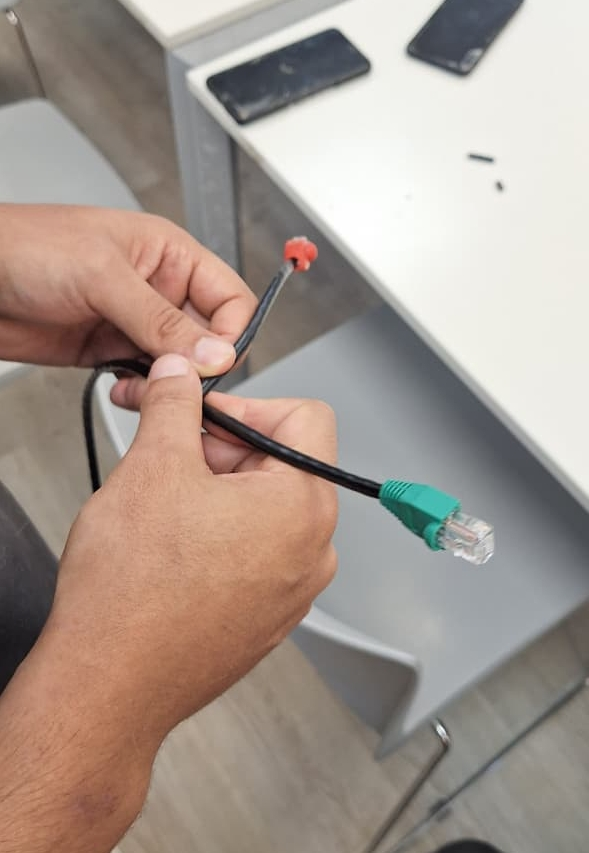
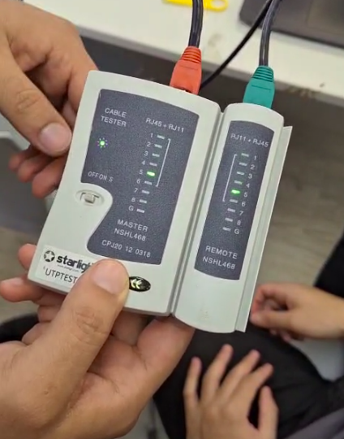
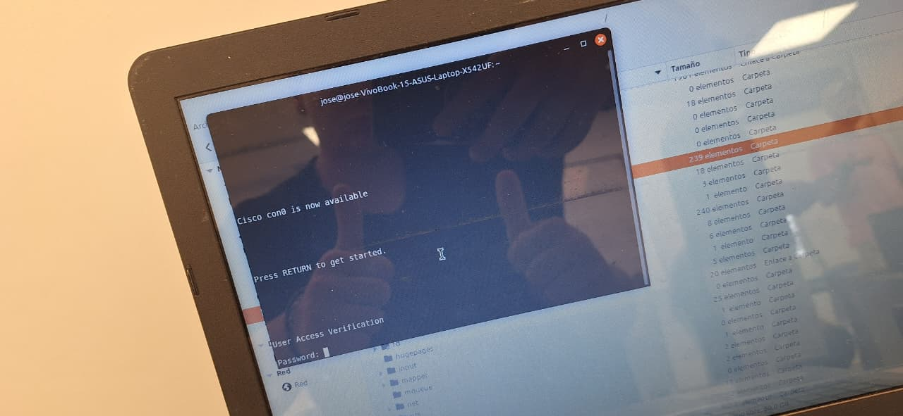
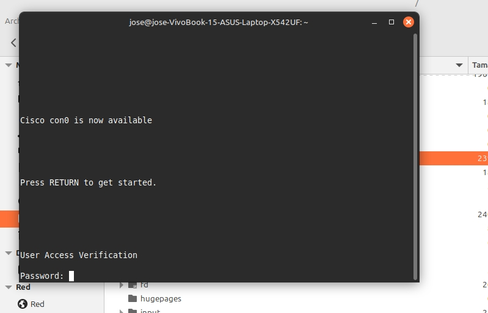
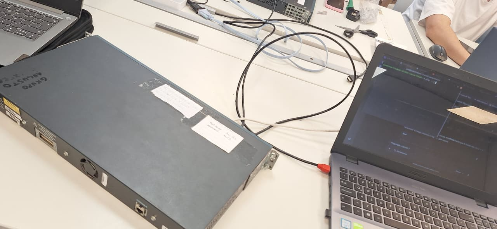

# Redes de Computadoras 2026

## Trabajo Práctico N°2

**Integrantes:** 
- Callovi, Lautaro
- Galoppo, José María
- Moreyra, Julián
- Rivera, Luis Mariano

**Grupo:** pingCollins  
**Centro educativo:** FCEFyN - UNC  
**Asignatura:** Redes de Computadoras  

**Profesores:**
- Henn, Santiago M.
- Oliva Cuneo, Facundo N.

**Fecha de entrega:** ...

---

### Información de los autores
- `jose.maria.galoppo@mi.unc.edu.ar` (Galoppo, José María)
- `luismarianorivera.25@mi.unc.edu.ar` (Rivera, Luis Mariano)
- `julian.moreyra@mi.unc.edu.ar` (Moreyra, Julián)
- `lautaro.callovi@mi.unc.edu.ar` (Callovi, Lautaro Nicolás)

---

## Resumen

En el presente trabajo práctico se abordó la implementación física y lógica inicial de una red de área local (LAN). La experiencia se dividió en dos etapas fundamentales: la confección y validación de cableado estructurado UTP bajo la norma T568B, y la interacción mediante puerto de consola con equipamiento de red administrable (Cisco Catalyst 2950). Se analizan los procedimientos de conexión serial fuera de banda (*Out-of-Band*), la navegación básica por la interfaz de línea de comandos (CLI) y las problemáticas frecuentes en entornos de laboratorio, tales como discrepancias en los baudios de transmisión, bloqueos de acceso por contraseñas preexistentes y la ausencia de direccionamiento lógico para pruebas de conectividad en capa 3.

## Introducción

El despliegue de una red de computadoras requiere de un sólido entendimiento no solo de los protocolos subyacentes, sino también de la infraestructura de hardware que los soporta. Este laboratorio tiene como objetivo principal consolidar los conocimientos teóricos sobre la capa física y de enlace de datos del modelo OSI a través de la práctica directa. 

Para ello, se llevó a cabo el ensamblaje manual de un medio de transmisión físico, seguido por la configuración y el diagnóstico de un *switch* de capa 2. Enfrentarse a hardware real permite comprender de primera mano las tolerancias del medio físico, la rigurosidad de los estándares de cableado estructurado y los mecanismos de gestión esenciales para la administración inicial y la mitigación de fallas en la infraestructura de telecomunicaciones.

---

## Parte 1: Armado y verificación de cables Cat5/Cat5e bajo estándar T568A/B

### Actividades 1 y 2

En esta primera actividad se armó un cable físico UTP con ficha RJ-45 utilizando la norma **T568B** derecho. Básicamente, el orden de los colores es el siguiente:

1. Blanco/Naranja
2. Naranja
3. Blanco/Verde
4. Azul
5. Blanco/Azul
6. Verde
7. Blanco/Marrón
8. Marrón

Al ser un cable derecho, ambas terminales mantienen la misma norma. 

Los pasos estandarizados para *crimpear* son:

1. **Preparación:** Pelar aproximadamente 2 a 3 cm de la cubierta exterior del cable UTP utilizando la herramienta pelacables, teniendo cuidado de no dañar el aislamiento de los pares trenzados internos.
2. **Alineación:** Destrenzar los pares y alisar los hilos, ordenándolos cuidadosamente de izquierda a derecha según el estándar T568B especificado anteriormente.
3. **Corte y ajuste:** Realizar un corte recto con la crimpeadora para que todos los conductores queden exactamente a la misma longitud (aproximadamente 1.5 cm desde la base de la cubierta exterior).
4. **Inserción:** Insertar los hilos en el conector RJ-45 asegurando que los conductores de cobre lleguen hasta el fondo de los pines de contacto y que la cubierta exterior quede atrapada dentro de la pestaña de retención del conector para evitar tensiones mecánicas.
5. **Fijación:** Introducir el conector en la cavidad de la crimpeadora y aplicar presión firme hasta el tope para clavar los pines de contacto y sellar la pestaña plástica.



### Actividades 3 y 4

Intercambiamos cables con el grupo **Wan Piece** con el fin de realizar pruebas cruzadas de continuidad. Esta validación por pares es crucial para certificar que el cable armado no presenta cortes internos, atenuaciones anómalas ni cruces indebidos de pines, garantizando la viabilidad del enlace físico.



---

## Parte 2: Equipamiento físico, verificación y utilización de equipos de red y análisis de tráfico

### Actividad 1

Se utilizó el *switch* **Cisco Catalyst 2950SX-24**. Sus principales características son fundamentales para el diseño de la topología:

- **24 puertos** Fast Ethernet (10/100 Mbps) + **2 uplinks** Gigabit 1000BASE-SX (fibra).
- *Switching fabric* de 8.8 Gbps y *forwarding rate* de hasta 6.6 Mpps, garantizando un rendimiento sin bloqueos (*non-blocking*).
- Soporte de VLANs (IEEE 802.1Q) y *trunking* dinámico (DTP, VTP).
- **Seguridad avanzada:**
  - Autenticación 802.1x
  - Port Security (por MAC)
  - SSHv2
  - SNMPv3
  - VLANs privadas (Private VLAN Edge)
- **Administración mediante:**
  - Cisco IOS (CLI)
  - Interfaz web (Cisco Device Manager)
  - Cisco Network Assistant
  - SNMP
- **Memoria:** 16 MB DRAM, 8 MB Flash, *buffer* compartido de 8 MB.
- Tabla MAC de hasta 8000 direcciones.

### Actividad 2

#### **Checklists de configuración – Switch Cisco Catalyst 2950**

#### Procedimiento estándar (con PuTTY)
- Conectar el cable de consola (RJ-45 a USB-Serial) entre la PC y el *switch*.
- Identificar el puerto serial en la PC (`COMx` en Windows / `ttyUSBx` en Linux).
- Abrir PuTTY.
- Seleccionar tipo de conexión: **Serial**.
- Configurar los parámetros del puerto:
  - **Serial line:** `COMx`
  - **Speed (baud):** 9600
  - **Data bits:** 8
  - **Stop bits:** 1
  - **Parity:** None
  - **Flow control:** None
- Abrir la conexión.
- Presionar **Enter** hasta obtener el *prompt* del *switch*.

- Entrar al modo privilegiado: `enable`
- Ingresar contraseña (si existe).
- Entrar a la configuración global: `configure terminal`

- Cambiar contraseña de modo privilegiado: `enable secret NUEVA_PASSWORD`

- Configurar el acceso por consola:
```bash
line console 0
password NUEVA_PASSWORD
login
exit
```
- Guardar la configuración: `write memory`

- Conectar cada PC a un puerto del *switch* con cable Ethernet (UTP).
- Verificar que los LEDs de *link* estén activos.

- Desde la PC1: `ping 192.168.1.11`
- Desde la PC2: `ping 192.168.1.10`

---

#### Procedimiento real utilizado (Linux + screen)
- Conectar el cable consola (USB-Serial o adaptador).
- Verificar el puerto asignado por el sistema operativo:
```bash
ls /dev/ttyUSB*
```
- Conectarse mediante la utilidad **screen**:
```bash
screen /dev/ttyUSB0 9600
```
- Presionar **Enter** varias veces para inicializar la terminal.

#### Problemas encontrados
A 9600 baudios (la configuración por defecto), los caracteres no eran legibles en algunos *switches*, denotando un desajuste en la velocidad de reloj del puerto serial. Se procedió a realizar pruebas sistemáticas con distintas velocidades (*baud rates*):
```bash
screen /dev/ttyUSB0 115200
screen /dev/ttyUSB0 38400
```



Adicionalmente, se detectó que la contraseña de administración del *switch* ya había sido modificada por usuarios anteriores. Al carecer de credenciales válidas, no se pudo acceder al modo privilegiado (`enable`). Esto bloqueó la posibilidad de realizar la configuración lógica del equipo (asignación de nombres, contraseñas o particionamiento lógico de la red).

---

## Actividad 3

Teníamos habilitada la configuración dinámica de IP por DHCP en nuestras terminales. Al encontrarnos en una red aislada sin un servidor DHCP activo que emitiera concesiones (*leases*), las tarjetas de red no obtuvieron direccionamiento IP válido. Por esta falta de ruteo lógico en capa 3, no pudimos emitir los paquetes ICMP Echo Request y falló el intento de hacer *ping* entre los *hosts*.



---

## Conclusión

La experiencia de laboratorio evidenció la estricta dependencia secuencial que existe entre las distintas capas del modelo de red. El ensamblaje de la capa física (confección del cableado UTP) demostró ser el eslabón primario; sin embargo, contar con continuidad eléctrica no garantiza la operabilidad si no se gestiona adecuadamente la capa de enlace.

La interacción con hardware real reveló las complejidades del acceso *Out-of-Band* mediante terminales seriales. Los contratiempos superados, como la desincronización de baudios, y las limitaciones enfrentadas, como la imposibilidad de escalar privilegios debido a contraseñas heredadas o la falla de capa 3 por dependencia de DHCP, sirvieron como un excelente ejercicio práctico de *troubleshooting*. Se concluye que el diagnóstico en redes requiere un enfoque metódico y *top-down/bottom-up* para lograr aislar problemas tanto en los medios de transmisión como en las configuraciones lógicas del equipamiento.