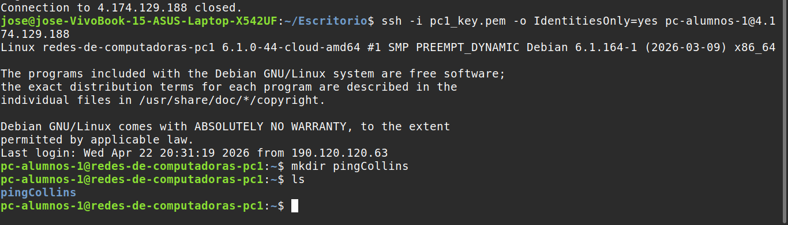
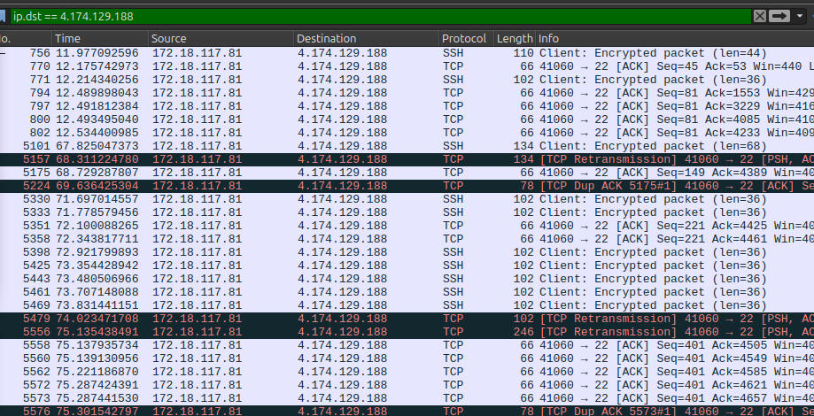
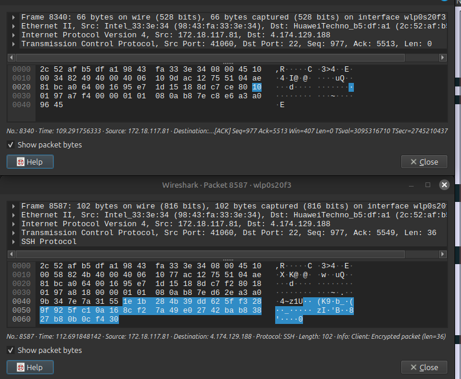

# Redes de Computadoras 2026  

## Trabajo Práctico N°3  

**Integrantes:**  
- Callovi, Lautaro  
- Galoppo, José María  
- Moreyra, Julián  
- Rivera, Luis Mariano  

**Grupo:** pingCollins  
**Centro educativo:** FCEFyN - UNC  
**Asignatura:** Redes de Computadoras  

**Profesores:**  
- Henn, Santiago M.  
- Oliva Cuneo, Facundo N.  

**Fecha de entrega:** ...  

---

### Información de los autores
- `jose.maria.galoppo@mi.unc.edu.ar` (Galoppo, José María)  
- `luismarianorivera.25@mi.unc.edu.ar` (Rivera, Luis Mariano)  
- `julian.moreyra@mi.unc.edu.ar` (Moreyra, Julián)  
- `lautaro.callovi@mi.unc.edu.ar` (Callovi, Lautaro Nicolás)  

---

## Resumen  

En el presente trabajo práctico se abordó el estudio y la utilización del protocolo **SSH (Secure Shell)** como mecanismo seguro para el acceso remoto entre sistemas. Se analizaron los conceptos fundamentales relacionados con la autenticación criptográfica mediante claves públicas y privadas, así como las diferencias entre autenticación y cifrado dentro del contexto de la seguridad en redes.

Adicionalmente, se verificó el establecimiento de conexiones SSH entre hosts y se realizó la captura y análisis de tráfico mediante la herramienta Wireshark, permitiendo observar la naturaleza cifrada de las comunicaciones. Finalmente, se relacionaron los conceptos aprendidos en trabajos prácticos anteriores con un escenario de ataque real basado en retransmisión de datos, destacando la importancia de la confidencialidad y la autenticación en redes modernas.

---

## Introducción  

El acceso remoto seguro constituye un componente esencial en la administración de sistemas y redes modernas. La necesidad de proteger la información transmitida entre dispositivos ha impulsado el desarrollo de protocolos criptográficos capaces de garantizar la confidencialidad e integridad de los datos durante la comunicación.

En este laboratorio se trabajó con el protocolo **SSH (Secure Shell)**, el cual permite establecer conexiones remotas cifradas entre dispositivos a través de redes potencialmente inseguras. Se estudiaron los principios criptográficos que sustentan su funcionamiento, particularmente el uso de pares de claves públicas y privadas para la autenticación de usuarios.

Además, se analizaron los mecanismos de cifrado aplicados a las comunicaciones y su impacto en la protección de la información transmitida. A partir del uso de herramientas de análisis de tráfico, se verificó experimentalmente que los datos intercambiados mediante SSH permanecen inaccesibles a observadores externos. Finalmente, se establecieron vínculos conceptuales entre los contenidos desarrollados en los trabajos prácticos anteriores y problemáticas reales relacionadas con la seguridad en redes.

--- 

## Actividad 1  

El protocolo **SSH (Secure Shell)** es un protocolo de red diseñado para establecer una comunicación segura y cifrada entre dos hosts a través de una red. Este protocolo utiliza un sistema de autenticación basado en pares de claves criptográficas y, por defecto, opera sobre el puerto 22. Su principal objetivo es resolver el problema de la transmisión insegura de datos, protegiendo la información contra accesos no autorizados y ataques como la interceptación de datos durante la comunicación.

Dentro del contexto de la seguridad informática, es fundamental distinguir entre los conceptos de **autenticación** y **cifrado**. La autenticación consiste en el proceso de verificar la identidad de un usuario o sistema, asegurando que quien intenta acceder es realmente quien afirma ser. Por otro lado, el cifrado implica la aplicación de un algoritmo que transforma el contenido de un mensaje en un formato ilegible, con el objetivo de ocultar la información y evitar que pueda ser interpretada por personas no autorizadas.

El funcionamiento de SSH se basa en el uso de un par de claves criptográficas compuesto por una **clave pública** y una **clave privada**. Estas claves pueden entenderse mediante una analogía entre una cerradura y una llave: la clave pública actúa como una cerradura que puede distribuirse libremente, mientras que la clave privada representa la llave que solo posee el propietario legítimo. Este par de claves está asociado a algoritmos de cifrado y descifrado que permiten proteger la información y garantizar que únicamente quien posea la clave privada pueda acceder a los datos cifrados.

La clave privada constituye el elemento crítico dentro del sistema criptográfico, por lo que no debe compartirse bajo ninguna circunstancia. Su exposición permitiría a terceros suplantar la identidad del propietario legítimo, acceder a sistemas protegidos o descifrar información confidencial.

En comparación con los métodos tradicionales basados en contraseñas, las claves SSH presentan múltiples ventajas en términos de seguridad. Su utilización de algoritmos criptográficos hace extremadamente difícil su descifrado mediante ataques de fuerza bruta. Además, permiten la autenticación sin necesidad de introducir manualmente contraseñas en cada sesión, facilitando la automatización de tareas y reduciendo el riesgo de errores humanos. Asimismo, presentan menor vulnerabilidad frente a ataques asociados al robo o reutilización de contraseñas débiles.

---

## Actividad 2  

En esta etapa se verificó el establecimiento exitoso de una conexión remota utilizando el protocolo SSH. La prueba consistió en acceder a un host remoto desde el sistema local, confirmando la disponibilidad del servicio y el correcto funcionamiento del mecanismo de autenticación.

La verificación de la conexión se realizó mediante el acceso al directorio correspondiente en el entorno del usuario remoto, confirmando que la sesión fue establecida correctamente y que el sistema respondió de manera adecuada a los comandos ejecutados.

---

## Actividad 3  

Se utilizó la herramienta **Wireshark** para capturar tráfico generado durante una sesión SSH con el objetivo de analizar la estructura de los paquetes transmitidos. Durante el proceso de inspección se observaron paquetes correspondientes al protocolo SSH, evidenciando la existencia de datos encapsulados y cifrados.

Al analizar el contenido de los paquetes capturados, se verificó que no es posible descifrar la información transmitida sin disponer de las claves criptográficas correspondientes. Esta observación confirma experimentalmente que el cifrado aplicado por el protocolo SSH protege el contenido de la comunicación contra intentos de lectura por parte de terceros.

  

---  

## Actividad 6  

En el video se presenta un ataque de retransmisión en sistemas de pago mediante tecnología NFC. Este escenario guarda relación directa con los contenidos desarrollados en los trabajos prácticos anteriores.

En el **Trabajo Práctico 1**, se estudiaron los mecanismos de envío de paquetes entre dispositivos, incluyendo conceptos de encapsulación y comunicación entre nodos. Estos conocimientos resultan fundamentales para comprender el funcionamiento del ataque, ya que el atacante actúa como intermediario retransmitiendo la información entre el dispositivo móvil y el terminal de pago.

En el **Trabajo Práctico 2**, se trabajó con la capa física del modelo OSI, lo cual se relaciona con la tecnología NFC utilizada en el ataque. Este tipo de comunicación depende de enlaces inalámbricos de corto alcance, evidenciando la importancia de comprender el funcionamiento del medio físico en escenarios reales.

En el **Trabajo Práctico 3**, se abordó el acceso remoto mediante SSH y el análisis de comunicaciones cifradas. Este conocimiento resulta directamente aplicable al escenario presentado, ya que demuestra que, aunque los datos estén cifrados, es posible retransmitirlos sin necesidad de descifrarlos, permitiendo la ejecución de ataques sin conocer el contenido de la comunicación.

Desde el punto de vista del principio de **confidencialidad**, es fundamental considerar que la información debe ser accesible únicamente para usuarios autorizados. El escenario analizado demuestra que el cifrado por sí solo no garantiza completamente la confidencialidad si no se implementan mecanismos adecuados de validación de identidad y control del contexto de la comunicación.

Los resultados obtenidos durante el laboratorio evidencian que el tráfico cifrado protege el contenido de los datos, pero no impide su interceptación o retransmisión. Por esta razón, además del uso de cifrado, resulta necesario implementar mecanismos adicionales de autenticación y control de acceso físico para garantizar una protección integral de la información.

---

## Conclusión  

La realización de este trabajo práctico permitió comprender la importancia del protocolo SSH como herramienta fundamental para la administración segura de sistemas remotos. El estudio de los mecanismos criptográficos asociados a la autenticación mediante claves públicas y privadas permitió consolidar conocimientos relacionados con la protección de la identidad digital y la confidencialidad de la información.

La captura y análisis de tráfico mediante herramientas especializadas permitió verificar experimentalmente la efectividad del cifrado en la protección de datos transmitidos, evidenciando que la información intercambiada no puede ser interpretada sin las claves correspondientes.

Finalmente, la relación entre los contenidos del laboratorio y escenarios reales de ataque permitió comprender que la seguridad en redes no depende únicamente del cifrado, sino también de la correcta implementación de mecanismos de autenticación y control del acceso físico. Este enfoque integral resulta esencial para prevenir vulnerabilidades y garantizar la confidencialidad en entornos de comunicación modernos.