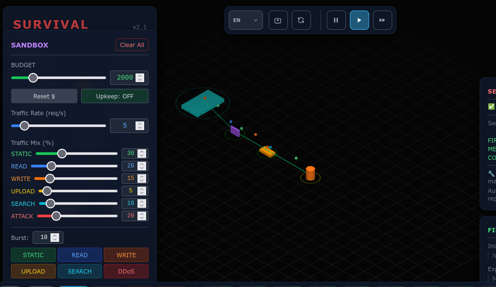
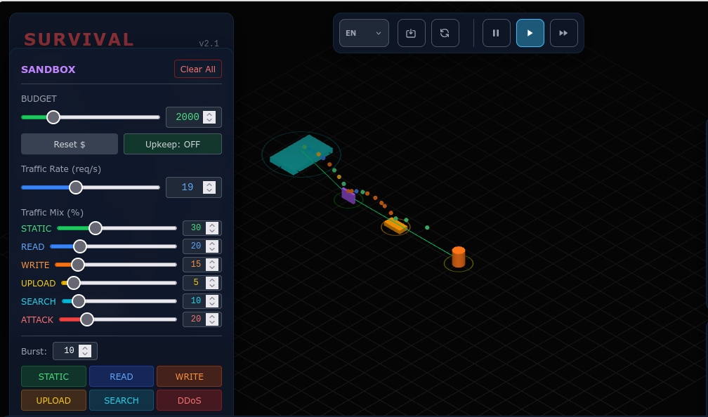
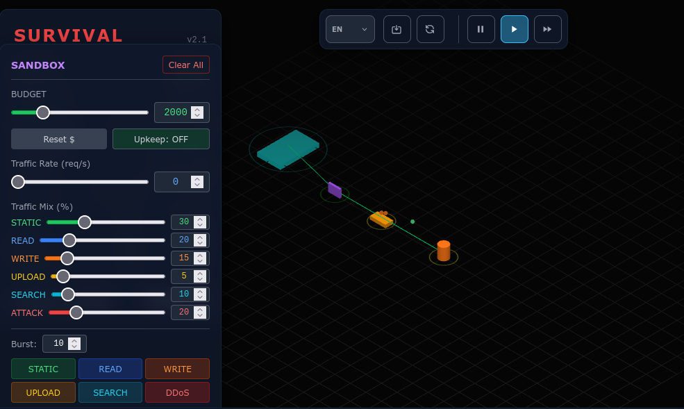
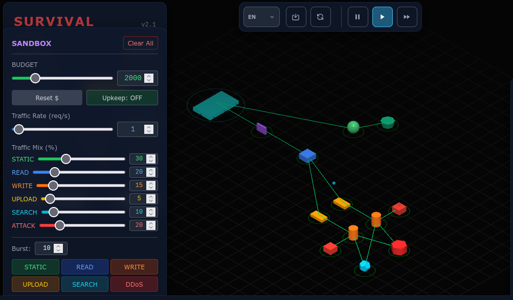
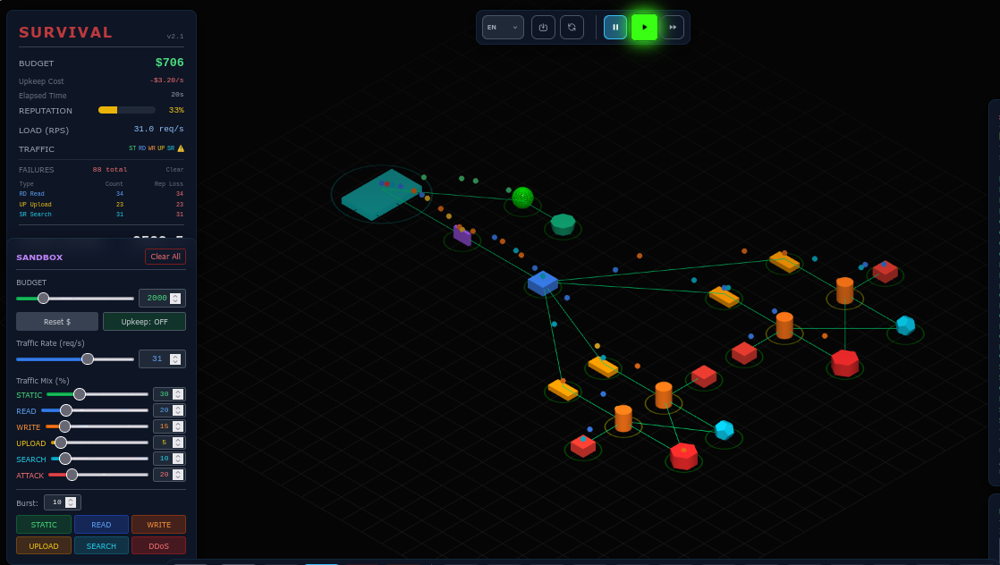
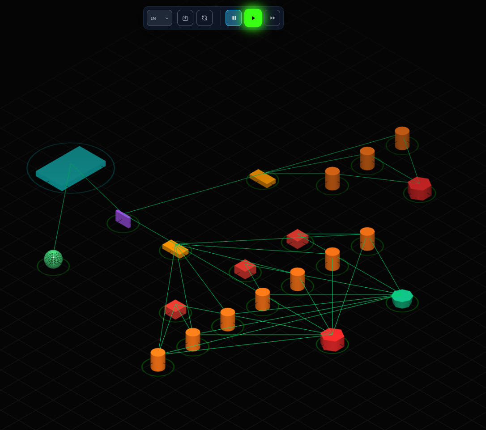

# Redes de Computadoras 2026  

## Trabajo Práctico N°5

**Integrantes:**  
- Callovi, Lautaro  
- Galoppo, José María  
- Moreyra, Julián  
- Rivera, Luis Mariano  

**Grupo:** pingCollins  
**Centro educativo:** FCEFyN - UNC  
**Asignatura:** Redes de Computadoras  

**Profesores:**  
- Henn, Santiago M.  
- Oliva Cuneo, Facundo N.  

---

### Información de los autores
- `jose.maria.galoppo@mi.unc.edu.ar` (Galoppo, José María)  
- `luismarianorivera.25@mi.unc.edu.ar` (Rivera, Luis Mariano)  
- `julian.moreyra@mi.unc.edu.ar` (Moreyra, Julián)  
- `lautaro.callovi@mi.unc.edu.ar` (Callovi, Lautaro Nicolás)  

---

## Resumen

En este trabajo práctico se analizaron distintos componentes de infraestructura utilizados en arquitecturas distribuidas y su relación con los diferentes tipos de tráfico presentes en aplicaciones modernas. A través del simulador se estudiaron conceptos de escalabilidad, disponibilidad y tolerancia a fallos, evaluando el comportamiento de componentes como firewalls, colas de mensajes, cachés, bases de datos, CDN y servidores de cómputo. Finalmente, se diseñaron y compararon distintas arquitecturas, identificando cuellos de botella y estrategias de escalado para mejorar el rendimiento del sistema.

---

## Introducción

Las aplicaciones actuales deben ser capaces de procesar grandes volúmenes de tráfico de manera eficiente, manteniendo tiempos de respuesta adecuados y garantizando la disponibilidad de los servicios. Para lograrlo, las arquitecturas modernas incorporan distintos componentes especializados que permiten distribuir la carga, almacenar información, proteger la infraestructura y optimizar el acceso a los recursos.

El objetivo de este trabajo fue analizar el rol de estos componentes dentro de una arquitectura distribuida y experimentar con distintas configuraciones mediante un simulador. A partir de los resultados obtenidos, se evaluó el impacto de cada decisión de diseño sobre la capacidad del sistema para soportar tráfico creciente y responder ante situaciones de alta demanda.

## Actividad 1  

**Firewall**  
Un firewall controla y filtra el tráfico de red entrante y saliente según reglas de seguridad definidas. Su función es impedir accesos no autorizados y proteger los recursos de la infraestructura frente a ataques o comunicaciones no permitidas.
Principalmente opera en la capa de Internet (IP) y Transporte (TCP/UDP). Los firewalls más avanzados también pueden inspeccionar protocolos de aplicación, por lo que pueden extenderse hasta la capa de Aplicación.
Sin el firewall, los sistemas quedarían expuestos directamente a accesos externos, aumentando significativamente el riesgo de ataques, intrusiones, escaneos de puertos y accesos no autorizados.

**Load Balancer**  
Un load balancer distribuye las solicitudes entrantes entre múltiples servidores de computación para optimizar el uso de recursos, maximizar el rendimiento y evitar la sobrecarga de un único servidor. Su función es garantizar alta disponibilidad y escalabilidad de las aplicaciones distribuidas.
Principalmente opera en la capa de Transporte (TCP/UDP) para balanceo de nivel 4, aunque los load balancers más avanzados pueden funcionar en la capa de Aplicación (HTTP/HTTPS) para decisiones más sofisticadas. También puede extenderse a la capa de Internet (IP) para balanceo de tráfico.
Sin el load balancer, el sistema no podría distribuir la carga de trabajo entre servidores, resultando en posibles cuellos de botella, baja disponibilidad ante fallos de un servidor, y uso ineficiente de los recursos de computación disponibles.

**Queue**  
Una queue gestiona la comunicación asincrónica entre componentes del sistema, almacenando temporalmente mensajes que serán procesados posteriormente. Su función es desacoplar productores de consumidores, permitir procesamiento asincrónico y garantizar que los mensajes se entreguen incluso si el consumidor no está inmediatamente disponible.
Principalmente opera en la capa de Aplicación, donde se implementa la lógica de almacenamiento y entrega de mensajes. Puede utilizar la capa de Transporte (TCP/UDP) para la comunicación de red entre productores, la cola y consumidores.
Sin la queue, los sistemas quedarían fuertemente acoplados, no soportarían picos de tráfico sin pérdida de datos, y el procesamiento tendría que ser completamente sincrónico, reduciendo significativamente la escalabilidad y resiliencia de la arquitectura.

**Compute**  
Instancias de computación provee los recursos de procesamiento necesarios para ejecutar aplicaciones y servicios. Su función es ejecutar lógica de negocio, procesar datos y alojar los servicios que conforman la aplicación.
Principalmente opera en la capa de Aplicación donde se ejecuta el código, aunque utiliza todas las capas inferiores (Transporte, Internet, Acceso a Red) para comunicarse con otros componentes de la infraestructura.
Sin compute, no habría recursos para ejecutar la lógica de la aplicación, por lo que la infraestructura no podría prestar ningún servicio. El sistema completo dejaría de funcionar.

**Serverless Function**  
Una serverless function es una unidad de código que se ejecuta bajo demanda sin necesidad de gestionar servidores explícitamente. Su función es ejecutar lógica específica de negocio de forma escalable, pagando solo por el tiempo de ejecución real.
Principalmente opera en la capa de Aplicación donde se ejecuta el código de la función. Utiliza las capas inferiores para comunicarse con otros servicios e interpretar las solicitudes que la desencadenan.
Sin serverless functions, sería necesario proveer y mantener compute continuamente, incluso durante períodos de inactividad, aumentando significativamente los costos operativos e introduciendo complejidad innecesaria en la gestión de infraestructura.

**SQL Database**  
Una SQL Database (base de datos relacional) almacena datos estructurados en tablas con relaciones definidas, proporcionando consistencia, integridad referencial y consultas complejas. Su función es persistir datos de forma confiable y permitir acceso rápido a la información mediante lenguaje SQL.
Principalmente opera en la capa de Aplicación donde se ejecuta el motor de base de datos y la lógica de consultas. Utiliza la capa de Transporte y Internet para recibir solicitudes desde aplicaciones remotas.
Sin SQL Database, los datos no podrían persistirse entre ejecuciones de la aplicación, se perdería información tras cada reinicio, y no habría forma de mantener relaciones entre entidades, comprometiendo completamente la funcionalidad de la mayoría de aplicaciones.

**NoSQL Database**  
Una NoSQL Database almacena datos no estructurados o semi-estructurados con esquemas flexibles, optimizada para escalabilidad horizontal y consultas rápidas sobre grandes volúmenes de datos. Su función es persistir datos con alta disponibilidad y rendimiento, especialmente en sistemas distribuidos.
Principalmente opera en la capa de Aplicación donde se ejecuta el motor de base de datos. Utiliza las capas de Transporte e Internet para comunicarse con múltiples nodos en sistemas distribuidos.
Sin NoSQL Database, sistemas con datos no estructurados o volúmenes masivos de información no podrían escalar horizontalmente de forma eficiente, disminuyendo el rendimiento y aumentando los costos de infraestructura significativamente.

**Cache**  
Un cache almacena copias de datos frecuentemente accedidos en memoria de alta velocidad, reduciendo latencia y la carga sobre componentes más lentos como bases de datos. Su función es mejorar el rendimiento y la experiencia del usuario al servir datos desde ubicaciones más rápidas.
Principalmente opera entre la capa de Aplicación y Transporte, interceptando solicitudes y sirviendo respuestas cacheadas sin necesidad de acceder a capas inferiores.
Sin cache, cada solicitud requeriría acceso a bases de datos o computación compleja, resultando en mayor latencia, degradación severa del rendimiento, aumento de carga en bases de datos y deterioro significativo de la experiencia del usuario.

**CDN (Content Delivery Network)**  
Un CDN distribuye contenido estático (imágenes, videos, archivos) a través de múltiples servidores geográficamente dispersos, acercando el contenido al usuario final. Su función es reducir latencia, optimizar el ancho de banda y mejorar la disponibilidad global del servicio.
Principalmente opera en la capa de Aplicación y Transporte, distribuyendo contenido através de rutas optimizadas en la capa de Internet para reducir saltos de red.
Sin CDN, todo el contenido estaría centralizado en un único servidor, causando alta latencia para usuarios lejanos, cuello de botella de ancho de banda, imposibilidad de escalar globalmente y degradación severa de la experiencia para usuarios en regiones remotas.

**Storage**  
Storage (almacenamiento de objetos) persiste archivos y datos no estructurados de forma escalable y duradera, proporcionando acceso mediante APIs RESTful. Su función es almacenar datos a largo plazo con alta disponibilidad y replicación automática.
Principalmente opera en la capa de Aplicación donde se exponen APIs de acceso, aunque utiliza las capas de Transporte e Internet para comunicarse con los clientes.
Sin Storage, no habría lugar para persistir archivos, datos de usuarios o backups, resultando en pérdida permanente de información, imposibilidad de recuperación ante fallos, y colapso total de la capacidad de almacenamiento de la aplicación.

**Search Engine**  
Un Search Engine indexa y permite búsquedas eficientes sobre grandes volúmenes de datos, proporcionando capacidades avanzadas de búsqueda, filtrado y análisis. Su función es permitir consultas complejas y búsqueda de texto completo de forma rápida sobre datos distribuidos.
Principalmente opera en la capa de Aplicación, donde se ejecuta la lógica de indexación y búsqueda. Utiliza las capas de Transporte e Internet para recibir solicitudes de búsqueda y retornar resultados.
Sin Search Engine, sería necesario realizar búsquedas secuenciales sobre todas las fuentes de datos, resultando en rendimiento prohibitivo, imposibilidad de realizar consultas complejas, y experiencia de usuario inaceptable al buscar información.

**Replica**  
Una Replica es una copia sincronizada de datos o servicios en múltiples ubicaciones, proporcionando redundancia, alta disponibilidad y recuperación ante desastres. Su función es garantizar continuidad del servicio en caso de fallo de un componente principal.
Principalmente opera en la capa de Aplicación donde se sincroniza el estado de los datos, aunque utiliza la capa de Transporte e Internet para replicar datos entre componentes geográficamente dispersos.
Sin Replicas, un único fallo en el componente primario causaría pérdida completa de datos o servicio, sin posibilidad de recuperación automática, resultando en downtime prolongado, pérdida de información crítica y violación de objetivos de disponibilidad.

## Actividad 2  

### Análisis de Tipos de Tráfico en el Simulador

| Tipo de Tráfico | Ejemplo Real | Componente Recomendado | Riesgo si se Procesa Incorrectamente |
|---|---|---|---|
| **STATIC** | Imágenes, CSS, JavaScript de una página web | CDN o Storage | Desperdicio de capacidad de cómputo, latencia innecesaria, alto consumo de ancho de banda de los servidores de aplicación |
| **READ** | Consultas de lectura de base de datos (SELECT), obtención de perfiles de usuario | SQL/NoSQL Database o Cache | Sobrecarga de la base de datos principal, latencia alta en respuestas, degradación de rendimiento sin caché, cuello de botella en acceso a datos |
| **WRITE** | Inserción o actualización de datos (INSERT, UPDATE, DELETE) en BD | SQL Database con transacciones y replicación | Pérdida de datos, corrupción de información, inconsistencia entre réplicas, conflictos concurrentes, violación de integridad referencial |
| **UPLOAD** | Subida de archivos grandes (videos, documentos, imágenes) | Storage (almacenamiento de objetos) | Cuellos de botella en compute, fallos de almacenamiento, latencia extrema, interrupción de uploads, desperdicio de memoria en servidores |
| **SEARCH** | Búsquedas complejas de texto completo, filtros avanzados en catálogos | Search Engine (Elasticsearch, Solr) | Búsquedas prohibitivamente lentas sin índices, sobrecarga extrema de la base de datos principal, tiempo de respuesta inaceptable para usuarios |
| **MALICIOUS** | Intentos de inyección SQL, fuerza bruta, DDoS, fuzzing, escaneo de puertos | Firewall / WAF (Web Application Firewall) | Ataques sin bloquear, compromiso de seguridad, pérdida de datos, acceso no autorizado a la infraestructura, downtime prolongado |

## Actividad 3  

### Infraestructura Mínima: Firewall + Queue + Compute

**Esquema desplegado:** Firewall → Queue → Compute Instance

#### Análisis del comportamiento de la Queue con cambios en el throughput

**Caso Base 1: Estado inicial con tráfico bajo**

En este primer caso, el rate de tráfico es bajo. La queue no acumula mensajes significativamente porque la instancia de computación puede procesar las solicitudes al ritmo que llegan. La latencia es mínima y el sistema está en equilibrio.

**Caso Base 2: Incremento del rate de tráfico (throughput alto)**

Cuando incrementamos el rate de tráfico, las solicitudes comienzan a llegar más rápido de lo que la instancia de computación puede procesarlas. **La queue se llena y acumula mensajes en espera.** Esto es exactamente lo que la queue está diseñada para hacer: amortiguar los picos de tráfico. Sin embargo, si el rate permanece alto y la capacidad de compute es insuficiente, la queue puede crecer indefinidamente, aumentando la latencia de respuesta.

**Caso Base 3: Reducción rápida del rate a cero**

Después de mantener un rate alto, cuando llevamos rápidamente el rate a cero, la queue continúa siendo procesada por la instancia de computación. **Los mensajes que se acumularon en la queue siguen saliendo hacia el compute aunque no lleguen solicitudes nuevas.** La queue actúa como amortiguador: aunque cese el flujo de entrada, el compute sigue drenando la queue hasta procesarla completamente. Esto demuestra la capacidad de desacoplamiento de la queue: permite que productores y consumidores trabajen a ritmos distintos.

## Actividad 4

La arquitectura resuelve:

- Tráfico estático y uploads: Los archivos estáticos usan CDN.

- Lecturas y escrituras de datos: Las solicitudes de lectura y escritura pasan por los servidores de aplicación hacia la base de datos. Las lecturas frecuentes se apoyan en las caché.

- Búsquedas: Las consultas de búsqueda se envían a un motor de búsqueda especializado, separado de la base de datos transaccional. 

- Ataques o tráfico malicioso: El tráfico entrante atraviesa un firewall de entrada.

## Actividad 5

Para soportar una mayor carga de tráfico se modificó la arquitectura. Se aplicaron las siguientes estrategias:

- Mayor capacidad de cómputo: Se agregaron nuevas instancias.
- Caché: Se agregó más caché
- Cola de mensajes: Se añadieron colas de mensajes para procesar tareas de forma asíncrona para cada compu nueva.
- Balanceador de carga: El balanceador ya formaba parte de la arquitectura anterior.

## Actividad 6

En la actividad realizada en clase se eligió la siguiente infraestructura:

La arquitectura logró alcanzar aproximadamente **55.300 puntos** antes de fallar, aunque lamentablemente no se conservaron capturas con el resultado final.

* **Firewall:** Se colocó al inicio de la arquitectura para filtrar y bloquear tráfico malicioso antes de que llegara a los demás componentes.
* **Cola de mensajes:** Se agregó una cola previa a las instancias de cómputo para desacoplar el procesamiento de solicitudes y absorber picos de tráfico.
* **Balanceador de carga:** No se utilizó en esta arquitectura, ya que la distribución del tráfico se manejó mediante las colas y la cantidad de instancias disponibles.
* **Base de datos:** Se utilizó para atender las operaciones de lectura, escritura y búsqueda.
* **Caché:** Se incorporó para reducir la carga sobre la base de datos y acelerar las consultas más frecuentes.
* **CDN:** Se utilizó para servir contenido estático y evitar que este tráfico impactara sobre los servidores principales.

### Cuello de botella

El primer cuello de botella apareció en las **instancias de cómputo**, que alcanzaron su capacidad máxima antes que el resto de los componentes. Las colas lograron absorber el aumento de tráfico de forma eficiente y la base de datos tardó considerablemente más en saturarse.

### Escalado futuro

Si se dispusiera de más presupuesto, el primer componente que se escalaría serían las **instancias de cómputo**, ya que representaron la principal limitación de capacidad de la arquitectura.

---

## Conclusión 

A lo largo de las actividades se comprobó que la elección adecuada de los componentes de infraestructura tiene un impacto directo sobre el rendimiento y la escalabilidad de un sistema. Elementos como las colas de mensajes, las cachés y las CDN permitieron absorber una mayor cantidad de tráfico y reducir la carga sobre los componentes más costosos.

Además, se observó que el escalado no depende únicamente de agregar más recursos, sino también de distribuir correctamente las responsabilidades entre los distintos componentes de la arquitectura. La experiencia obtenida permitió comprender de manera práctica cómo identificar cuellos de botella, evaluar alternativas de diseño y aplicar estrategias de escalabilidad para mejorar la capacidad de respuesta de un sistema distribuido.